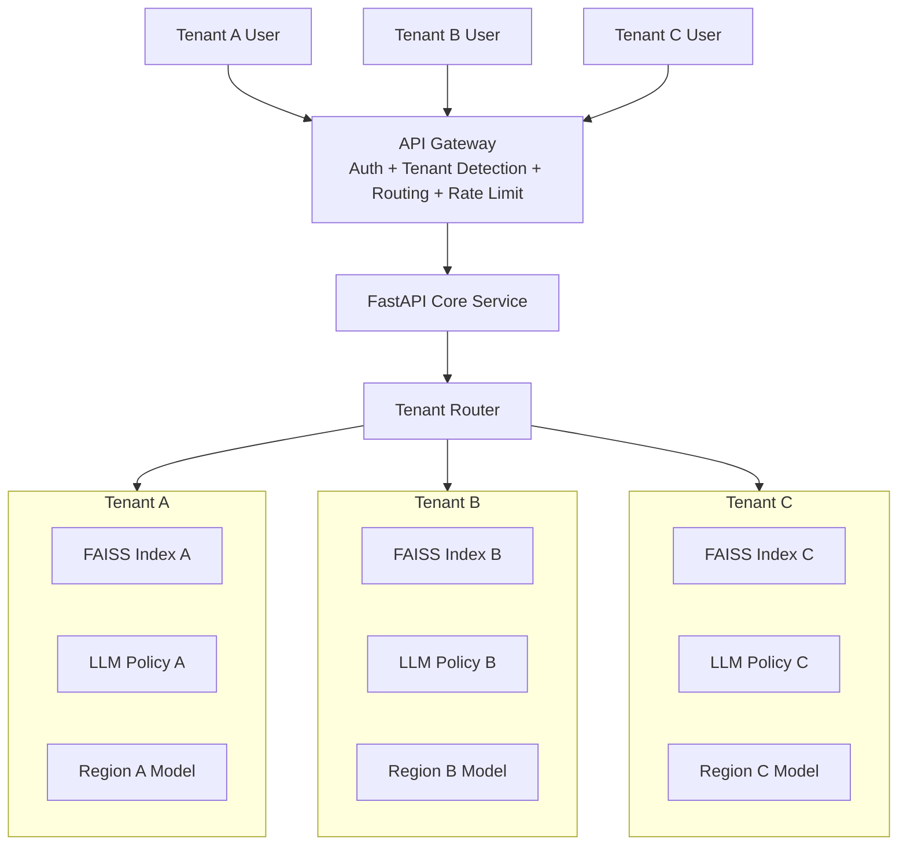

```mermaid
flowchart TD

%% Users
U1[Tenant A User]
U2[Tenant B User]
U3[Tenant C User]

%% Gateway Layer
GW[API Gateway<br/>Auth + Tenant Detection + Routing + Rate Limit]

%% Core API
API[FastAPI Core Service]

%% Tenant Router
TR[Tenant Router]

%% Tenant Isolation
subgraph TA[Tenant A]
    A1[FAISS Index A]
    A2[LLM Policy A]
    A3[Region A Model]
end

subgraph TB[Tenant B]
    B1[FAISS Index B]
    B2[LLM Policy B]
    B3[Region B Model]
end

subgraph TC[Tenant C]
    C1[FAISS Index C]
    C2[LLM Policy C]
    C3[Region C Model]
end

%% Flow
U1 --> GW
U2 --> GW
U3 --> GW

GW --> API
API --> TR

TR --> TA
TR --> TB
TR --> TC
```